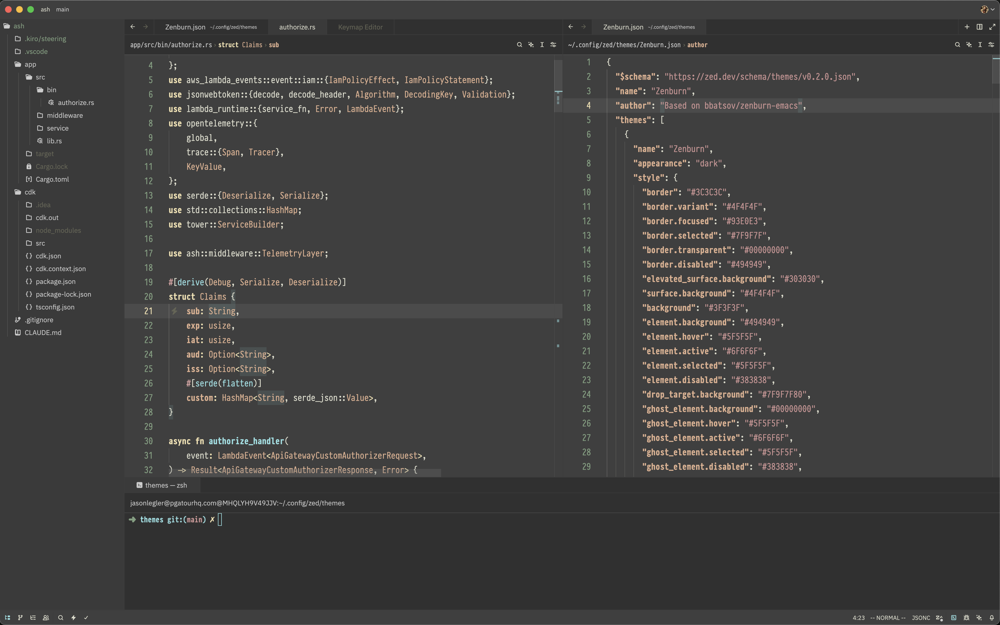

# Zenburn-zed

Zenburn is a low-contrast color scheme for Emacs, ported to Zed. It's easy on
the eyes and designed to keep you in the zone for long programming sessions.
Zenburn has been ported to many different editors and environments. For more
information and list of derivatives, visit https://kippura.org/zenburnpage.

## Installation

Drop this into `~/.config/zed/themes/Zenburn.json` and then choose it from
Settings -> Select Theme in the editor.
